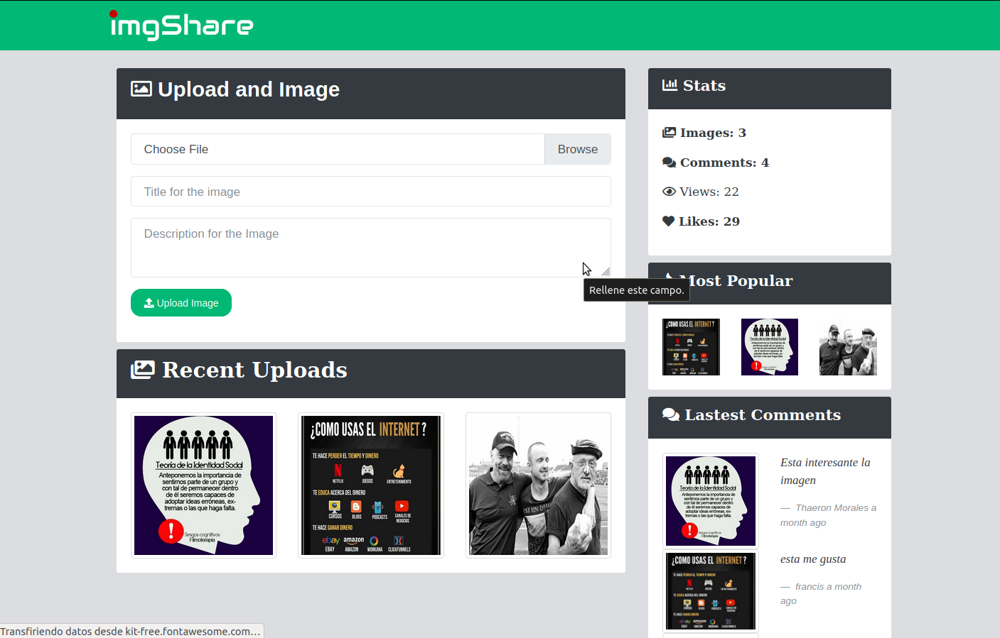
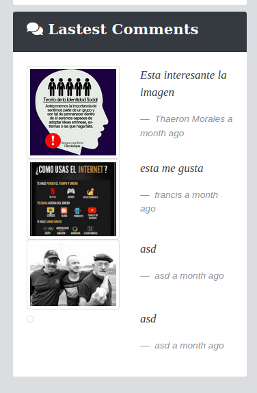

# img_social_nodeJs
App monolitica realizada con node.js en la que puedes compartir imagenes, añadir comentarios, likes, y veces vistas, sin modulo de autenticación pero con estadistica, comentarios mas recientes y imagenes mas vistas.
 

 

 

 

